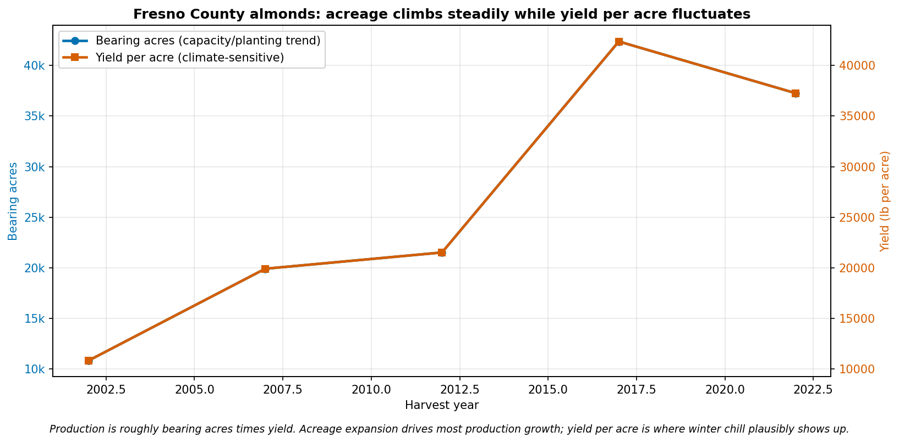
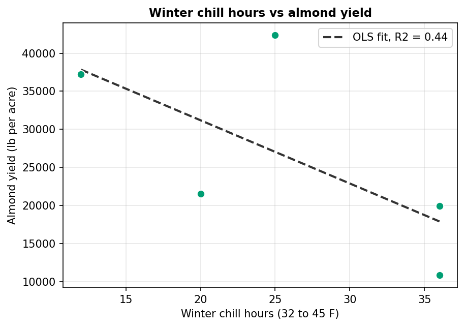
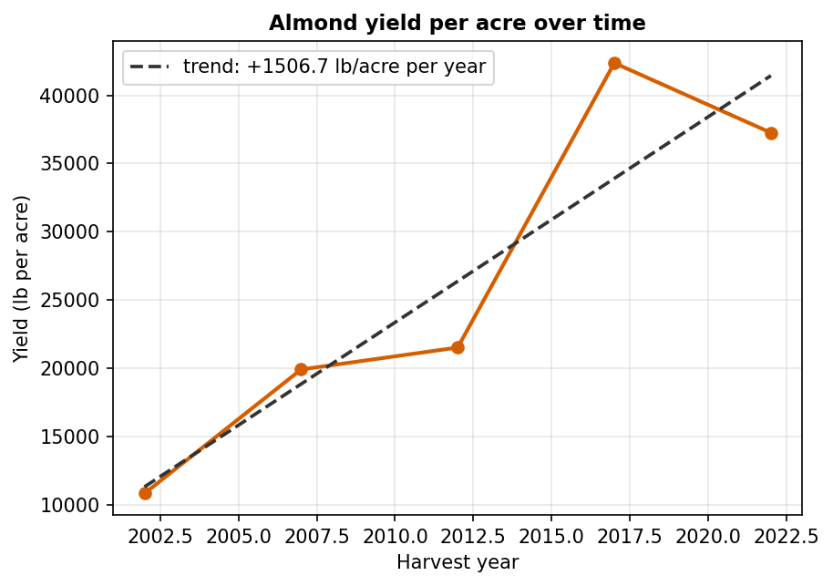
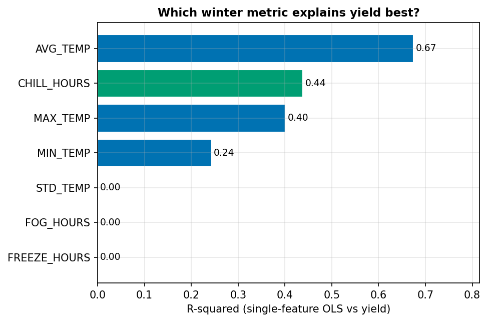

# Almond Chill Accumulation vs. Yield (Fresno County)

Does winter chill accumulation predict almond yield? A regression study of
Fresno County almond yield against engineered winter-weather features, built
for DSC450 as a group project (teammate names withheld; the modeling pass in
this notebook is my work).

## Notebooks

1. **[Data wrangling](fresno_almond_yield_wrangling.ipynb)** — USDA NASS Quick
   Stats (almond production and bearing acres) cleaned and converted to a
   per-year yield series.
2. **[Milestone 2 — chill vs. yield](almond_chill_vs_yield_milestone2.ipynb)** —
   merges three NOAA Local Climatological Data pulls (Fresno station), maps
   Nov/Dec weather to the following harvest year, engineers
   AVG/MIN/MAX/STD winter temperature, freeze hours (≤32°F), **chill hours
   (32–45°F)**, and fog hours; then compares single-feature OLS models and a
   multiple regression, with a chill-hours vs. average-temperature head-to-head.
   Ends with recommendations and an ethics discussion (derived-yield caveats,
   acreage confound, small-n limits).

## Key figures

| | |
|---|---|
|  |  |
|  |  |

## Data

USDA NASS Quick Stats and NOAA LCD exports are public data but not committed;
the notebooks document the exact pull parameters (Fresno County almonds;
NOAA station WBAN 93193) and auto-detect the standard export schemas.
